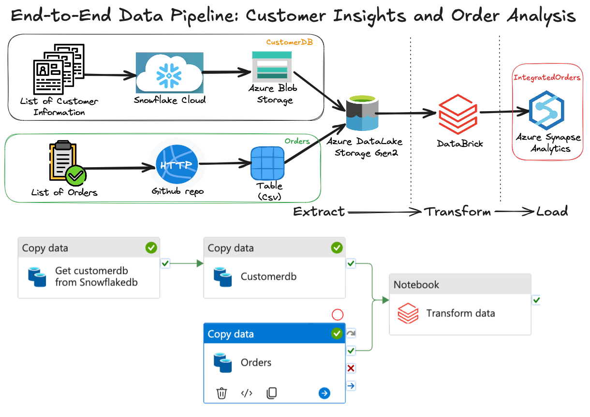
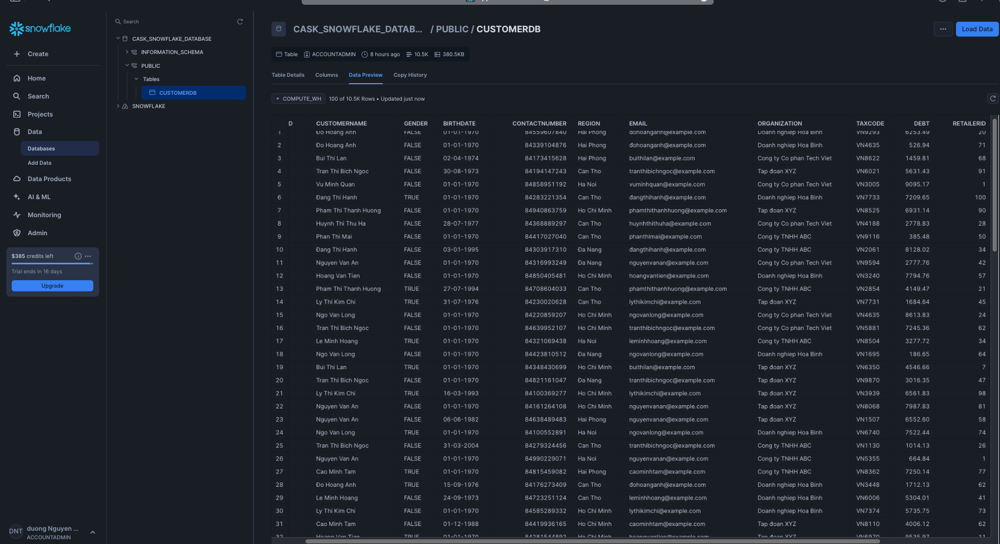
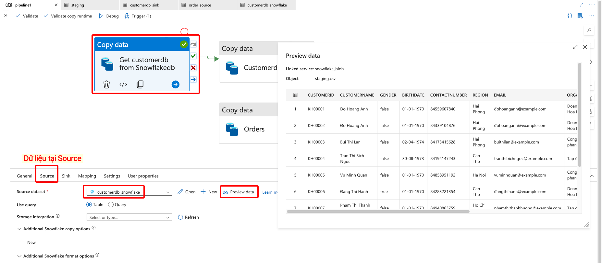
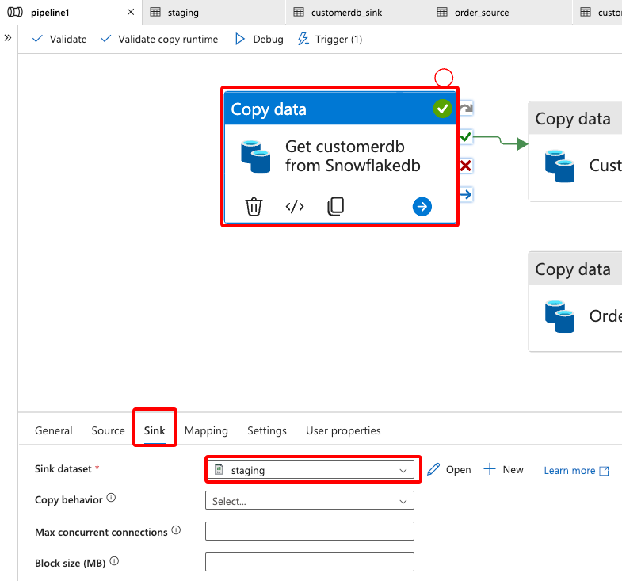
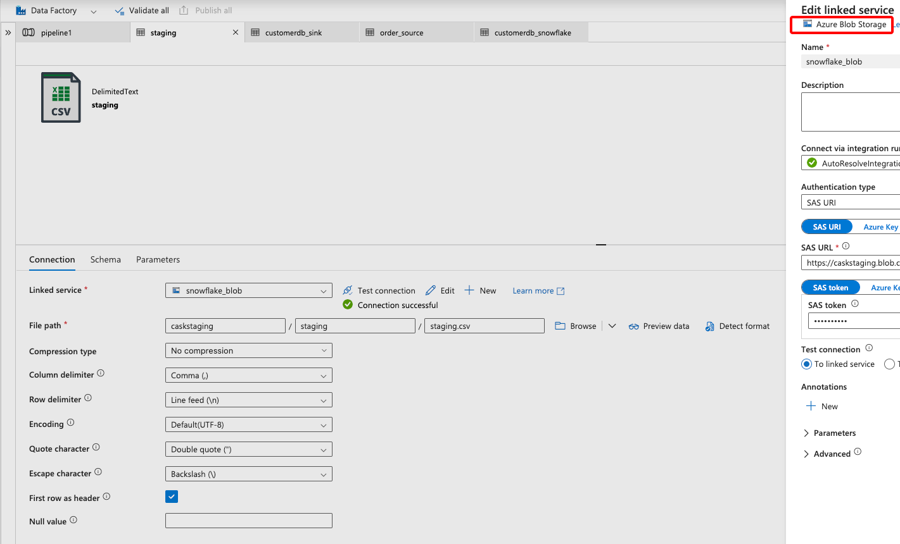
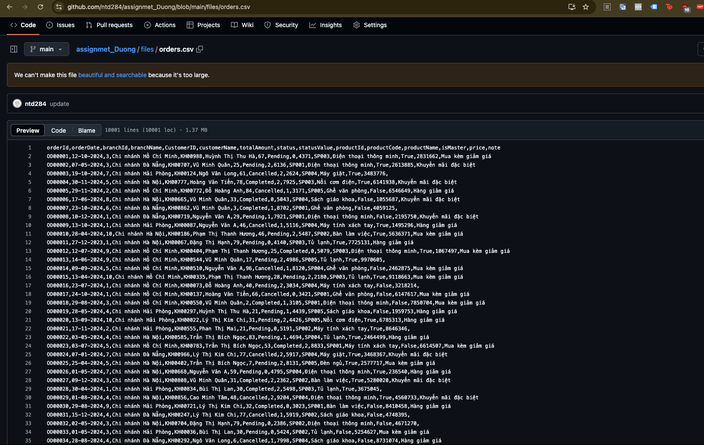

# 🚀 Dự Án Cask Insight: Phân Tích Thông Tin Khách Hàng và Đơn Hàng

# 📚 **Tổng Quan Dự Án**  
Tài liệu này mô tả quy trình để tích hợp và xử lý dữ liệu từ nhiều nguồn, sau đó sử dụng cho những mục đích **Phân tích hành vi người tiêu dùng**.

---

## 🛠️ **1. Kiến Trúc Quy Trình Tích Hợp**

### 📊 **Sơ Đồ Tích Hợp Dữ Liệu**  


### **Quy trình tích hợp bao gồm các bước chính:**
1. **Thu thập dữ liệu:** Dữ liệu khách hàng từ **Snowflake Cloud** và dữ liệu đơn hàng từ **GitHub repository** qua API và HTTP.  
2. **Lưu trữ dữ liệu:** Lưu trữ vào **Azure Blob Storage** và **Azure Data Lake Storage Gen2**.  
3. **Xử lý dữ liệu:** Dữ liệu được làm sạch và chuẩn hóa trên **Databricks**.  
4. **Tải dữ liệu:** Dữ liệu đã xử lý được tải vào **Azure Synapse Analytics** dành cho mục đích phân tích.  
---

## 📥 **2. Thu Thập Dữ Liệu (Extract)**  

### **Nguồn Dữ Liệu:**
- **Snowflake Cloud:** Dữ liệu thông tin khách hàng **(CustomerDB)** được trích xuất từ **Snowflake Cloud** bao gồm:

```
CustomerDB

{
  "CustomerID": "long",          // ID khách hàng
  "CustomerName": "string",      // Tên khách hàng
  "gender": "boolean?",          // Giới tính (true: nam, false: nữ)
  "birthDate": "date?",          // Ngày sinh khách hàng
  "contactNumber": "string",     // Số điện thoại khách hàng
  "Region": "string",            // Khu vực
  "email": "string",             // Email khách hàng
  "organization": "string",      // Công ty
  "taxCode": "string",           // Mã số thuế
  "debt": "decimal",             // Nợ hiện tại
  "retailerId": "int",           // ID cửa hàng
  "modifiedDate": "datetime?",   // Thời gian cập nhật
  "createdDate": "datetime"      // Thời gian tạo
}
```
- **GitHub Repo:** Dữ liệu đơn hàng **(Orders)** được trích xuất từ GitHub, bao gồm:

```
Orders

{
  "orderId": "long",            // ID đơn hàng
  "orderDate": "datetime",      // Ngày đặt hàng
  "branchId": "int",            // ID chi nhánh
  "branchName": "string",       // Tên chi nhánh
  "CustomerID": "long",         // ID khách hàng
  "customerName": "string",     // Tên khách hàng
  "totalAmount": "decimal",     // Tổng số tiền đơn hàng
  "status": "int",              // Trạng thái đơn hàng
  "statusValue": "string",      // Giá trị trạng thái đơn hàng (dạng chữ)
  "productId": "long",          // ID sản phẩm
  "productCode": "string",      // Mã sản phẩm
  "productName": "string",      // Tên sản phẩm
  "isMaster": "boolean",        // Hàng chính (true) hay hàng phụ (false)
  "price": "decimal",           // Giá sản phẩm
  "note": "string"              // Ghi chú đơn hàng
}
```
**AI-Generated Data:** Dữ liệu mẫu được tạo tự động bằng AI theo định dạng của **[KiotViet API](https://www.kiotviet.vn/huong-dan-su-dung-public-api-retail/)** để kiểm thử pipeline và mô phỏng dữ liệu thực tế.


### **Quy trình trích xuất:**
- **CustomerDB:** 
Dữ liệu khách hàng được sao chép từ **Snowflake cloud** vào **Azure Blob Storage**. 

Dữ liệu **CustomerDB** tại **Snowflake Cloud**



Được import vào **DataFactory**, chúng ta có thể check như sau:



Bởi vì Snowflake không hỗ trợ kết nối trực tiếp vào **Azure Data Lake Storage Gen2**, do đó cần một lớp trung gian như **Azure Blob Storage** như một bước đệm *(staging)*.

<div align="center">   </div>


<!-- 

-- **Orders:** Dữ liệu orders được sao chép từ **Github repo** vào **Azure Data Lake Storage Gen2**. 

Dữ liệu **Orders** tại **Github repo**

 -->