# 🚀 Dự Án Cask Insight: Phân Tích Thông Tin Khách Hàng và Đơn Hàng

# 📚 **Tổng Quan Dự Án**  
Tài liệu này mô tả quy trình để tích hợp và xử lý dữ liệu từ nhiều nguồn, sau đó sử dụng cho những mục đích **Phân tích hành vi người tiêu dùng**.

---

## 🛠️ **1. Kiến Trúc Quy Trình Tích Hợp**

### 📊 **Sơ Đồ Tích Hợp Dữ Liệu**  


### **Quy trình tích hợp bao gồm các bước chính:**
1. **Thu thập dữ liệu:** Dữ liệu khách hàng từ **Snowflake Cloud** và dữ liệu đơn hàng từ **GitHub repository** qua API và HTTP.  
2. **Lưu trữ dữ liệu:** Lưu trữ vào **Azure Blob Storage** và **Azure Data Lake Storage Gen2**.  
3. **Xử lý dữ liệu:** Dữ liệu được làm sạch và chuẩn hóa trên **Databricks**.  
4. **Tải dữ liệu:** Dữ liệu đã xử lý được tải vào **Azure Synapse Analytics** dành cho mục đích phân tích.  
---

## 📥 **2. Thu Thập Dữ Liệu (Extract)**  

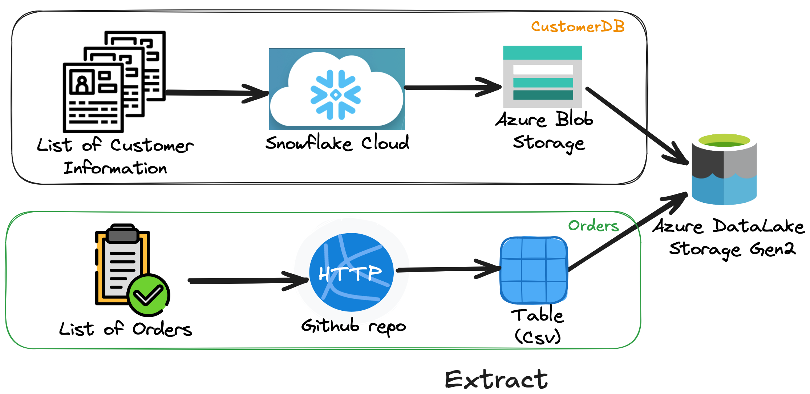

### **Nguồn Dữ Liệu:**
- **Snowflake Cloud:** Dữ liệu thông tin khách hàng **(CustomerDB)** được trích xuất từ **Snowflake Cloud** bao gồm:

```
CustomerDB

{
  "CustomerID": "long",          // ID khách hàng
  "CustomerName": "string",      // Tên khách hàng
  "gender": "boolean?",          // Giới tính (true: nam, false: nữ)
  "birthDate": "date?",          // Ngày sinh khách hàng
  "contactNumber": "string",     // Số điện thoại khách hàng
  "Region": "string",            // Khu vực
  "email": "string",             // Email khách hàng
  "organization": "string",      // Công ty
  "taxCode": "string",           // Mã số thuế
  "debt": "decimal",             // Nợ hiện tại
  "retailerId": "int",           // ID cửa hàng
  "modifiedDate": "datetime?",   // Thời gian cập nhật
  "createdDate": "datetime"      // Thời gian tạo
}
```
- **GitHub Repo:** Dữ liệu đơn hàng **(Orders)** được trích xuất từ GitHub, bao gồm:

```
Orders

{
  "orderId": "long",            // ID đơn hàng
  "orderDate": "datetime",      // Ngày đặt hàng
  "branchId": "int",            // ID chi nhánh
  "branchName": "string",       // Tên chi nhánh
  "CustomerID": "long",         // ID khách hàng
  "customerName": "string",     // Tên khách hàng
  "totalAmount": "decimal",     // Tổng số tiền đơn hàng
  "status": "int",              // Trạng thái đơn hàng
  "statusValue": "string",      // Giá trị trạng thái đơn hàng (dạng chữ)
  "productId": "long",          // ID sản phẩm
  "productCode": "string",      // Mã sản phẩm
  "productName": "string",      // Tên sản phẩm
  "isMaster": "boolean",        // Hàng chính (true) hay hàng phụ (false)
  "price": "decimal",           // Giá sản phẩm
  "note": "string"              // Ghi chú đơn hàng
}
```
**AI-Generated Data:** Dữ liệu mẫu được tạo tự động bằng AI theo định dạng của **[KiotViet API](https://www.kiotviet.vn/huong-dan-su-dung-public-api-retail/)** để kiểm thử pipeline và mô phỏng dữ liệu thực tế.


### **Quy trình trích xuất:**

- **CustomerDB:** Dữ liệu khách hàng được sao chép từ **Snowflake cloud** vào **Azure Data Lake Storage Gen2**. 

Dữ liệu **CustomerDB** tại **Snowflake Cloud**


Được import vào **DataFactory**, chúng ta có thể check như sau:


Bởi vì Snowflake không hỗ trợ kết nối trực tiếp vào **Azure Data Lake Storage Gen2**, do đó cần một lớp trung gian như **Azure Blob Storage** như một bước đệm *(staging)*.

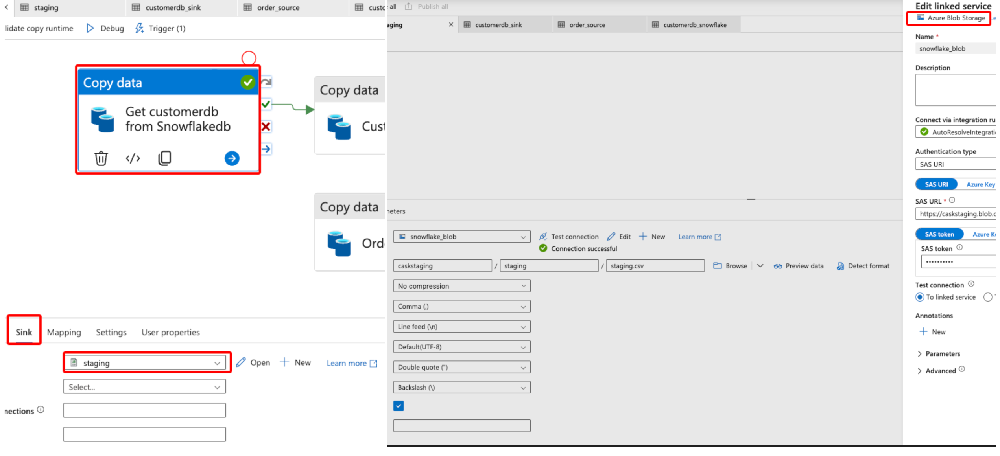

Bước tiếp theo sẽ copy dữ liệu từ **Azure Blob Storage** sang **Azure Data Lake Storage Gen2** với source và sink như sau:

Tại Source trích xuất từ **Azure Blob Storage**:

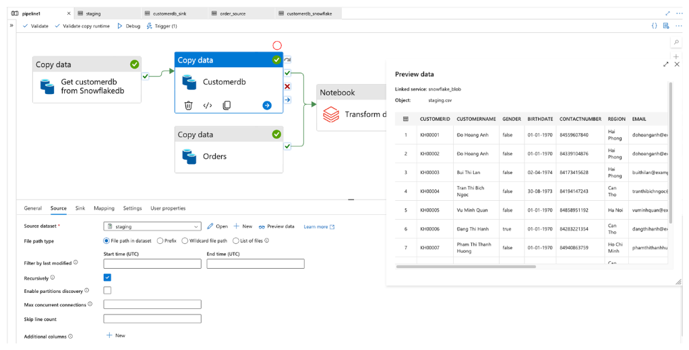
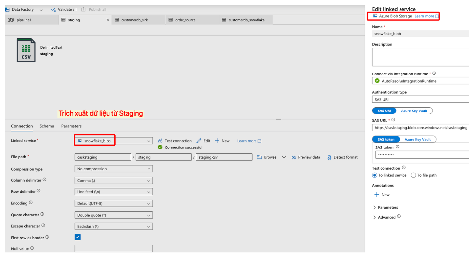

Tại Sink dữ liệu Customer được loads vào **Azure Data Lake Storage Gen2**:

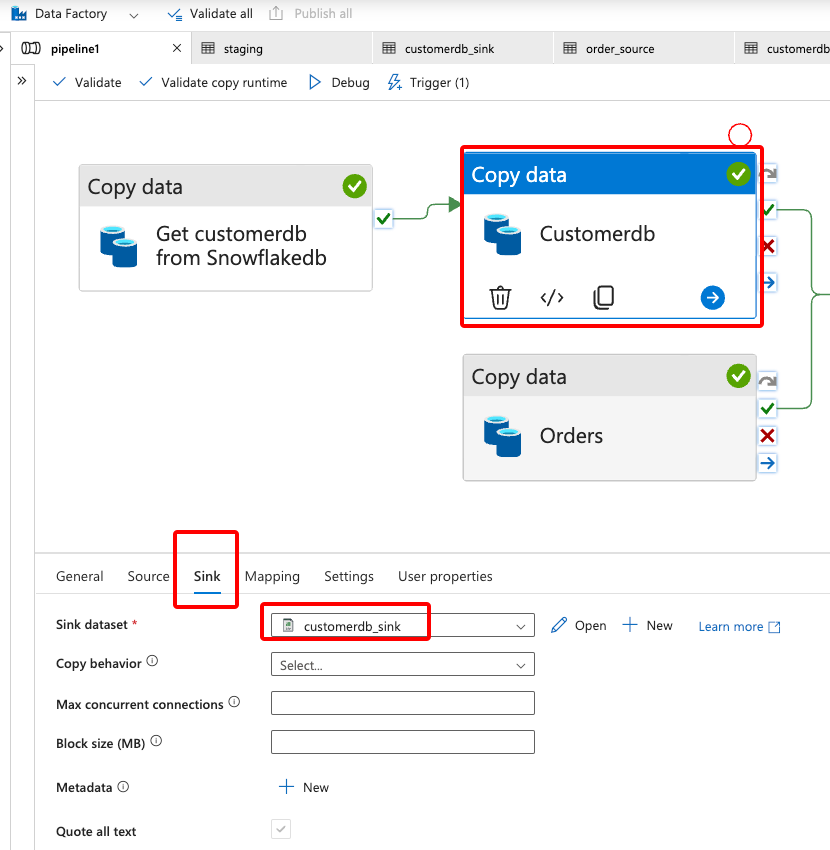
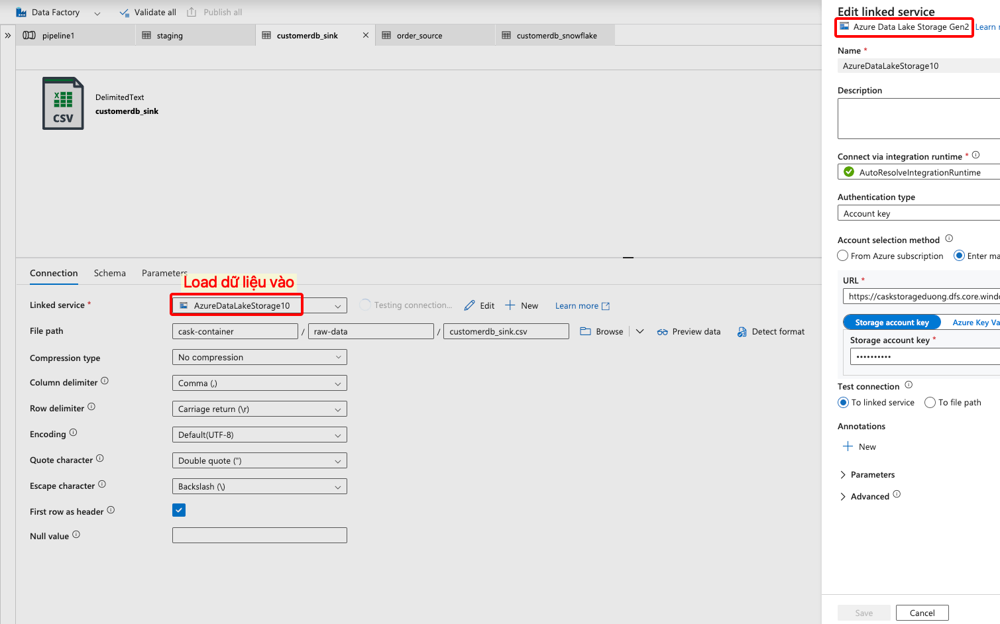

- **Orders:** Dữ liệu đơn hàng được chuyển vào **Azure Data Lake Storage Gen2** qua **HTTP**:

Source tại Github repo:


Tại Source trích xuất từ **HTTP**:

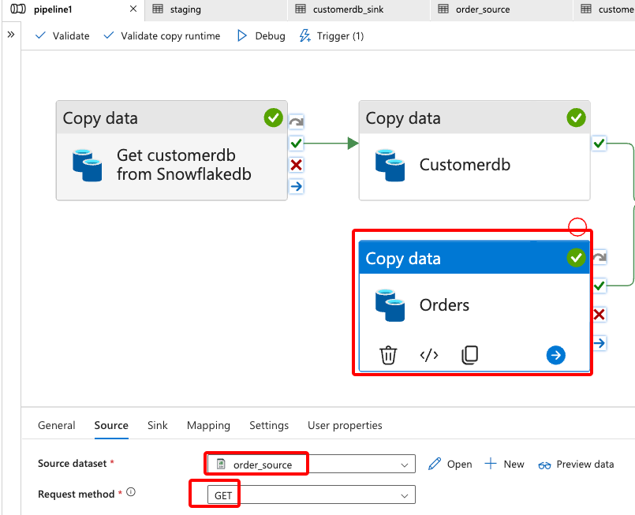
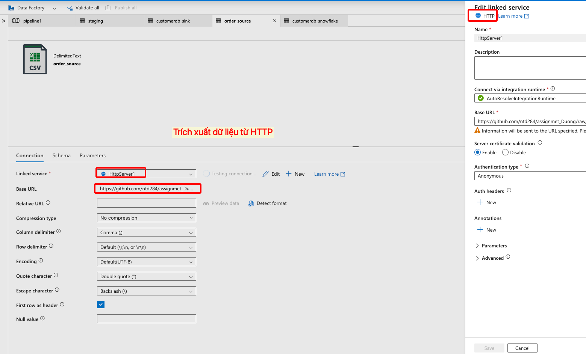

Tại Sink dữ liệu order được load vào **Azure Data Lake Storage Gen2**:

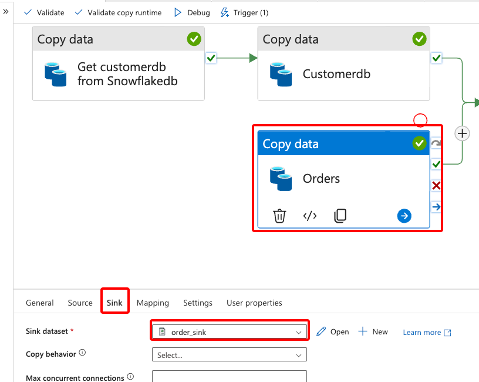

## 🔄 **3. Xử Lý Dữ Liệu (Transform)** [Link](Cask-databrick-notebook.ipynb)

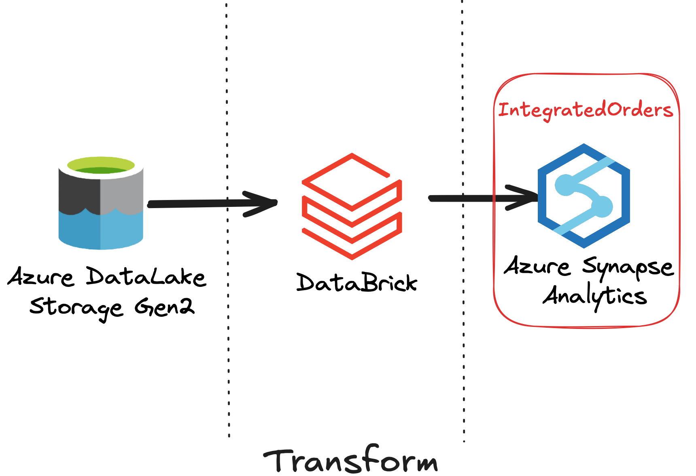

### **Quy trình xử lý dữ liệu:**  

- Sử dụng **Databricks Notebook** để:  
   - Làm sạch và chuẩn hóa dữ liệu.  
   - Kết hợp dữ liệu khách hàng và đơn hàng.  

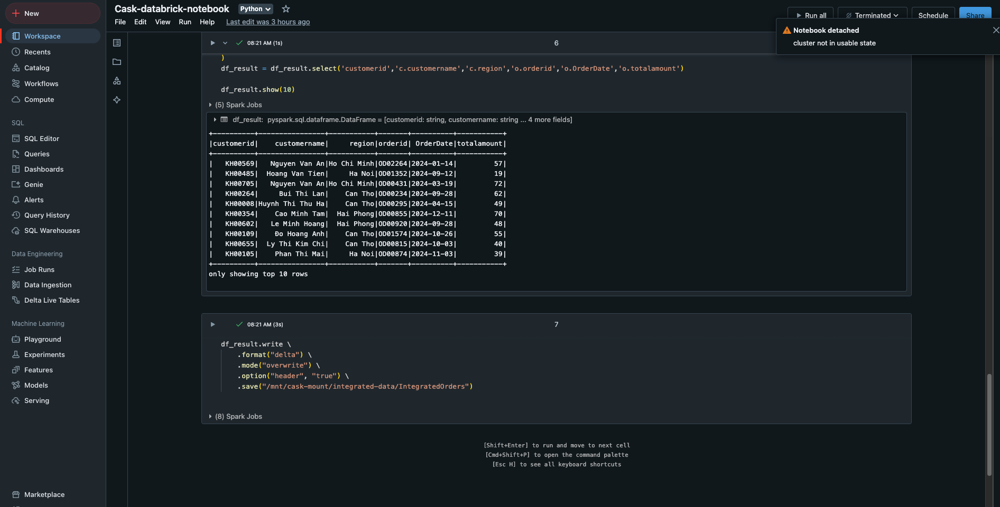

Với các config chính liên quan tới Databrick và permission:

Permission chúng ta sẽ phải đăng ký đối với Storage muốn sử dụng:

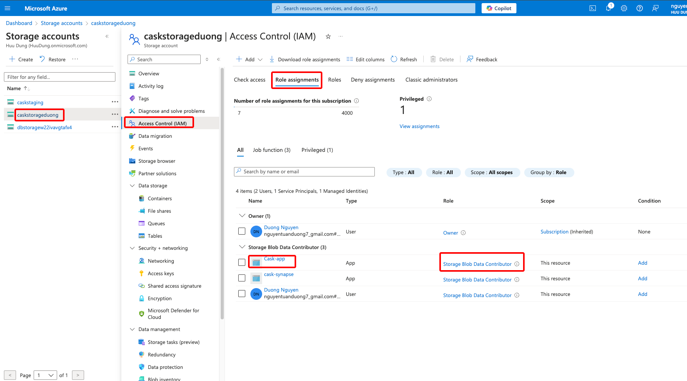

Sau đó lấy các thông tin cần thiết như *client_id*, *client_secret* và *directory* và thêm vào config
```
configs = {"fs.azure.account.auth.type": "OAuth",
"fs.azure.account.oauth.provider.type": "org.apache.hadoop.fs.azurebfs.oauth2.ClientCredsTokenProvider",
"fs.azure.account.oauth2.client.id": "[client_id]",
"fs.azure.account.oauth2.client.secret": 'client_secret',
"fs.azure.account.oauth2.client.endpoint": "https://login.microsoftonline.com/[directory]/oauth2/token"}

if any(mount.mountPoint == "/mnt/cask-mount" for mount in dbutils.fs.mounts()):
    print("Mount point already exists. Skipping mount.")
else:
    dbutils.fs.mount(
        source="abfss://cask-container@caskng.dfs.core.windows.net",
        mount_point="/mnt/cask-mount",
        extra_configs=configs
    )
```

Load dữ liệu đã được xử lý vào **Azure Data Lake Storage Gen2** dành cho việc tiếp theo:

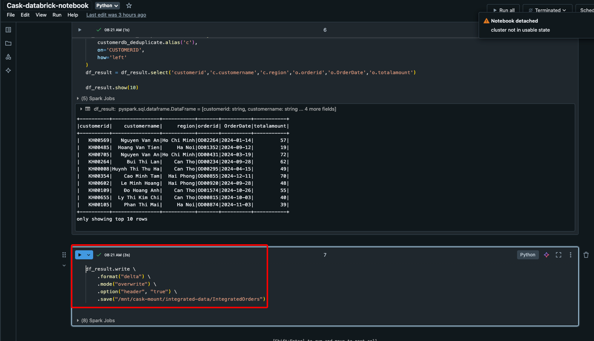

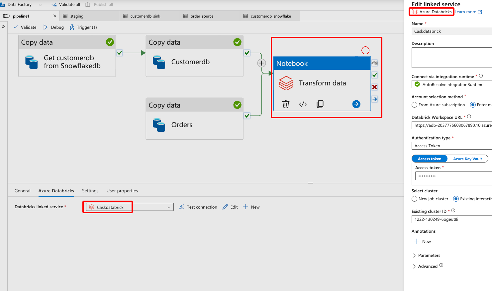

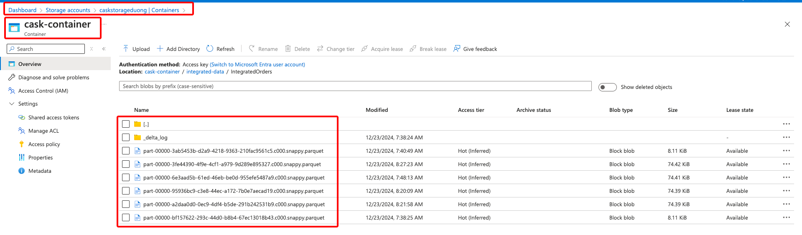

## 📊 **4. Tải Dữ Liệu (Load)**  

### **Quy trình tải dữ liệu:**  

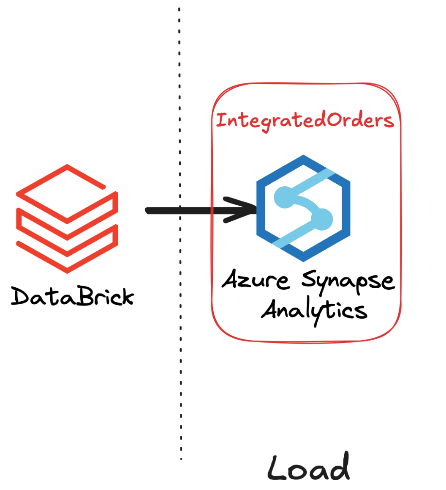

- Dữ liệu đã xử lý từ **Databricks** được tải vào **Azure Synapse Analytics**.  

Từ **Azure Synapse Analytics**, ta có thể trích xuất các file đã được loads lên từ **Databricks**.

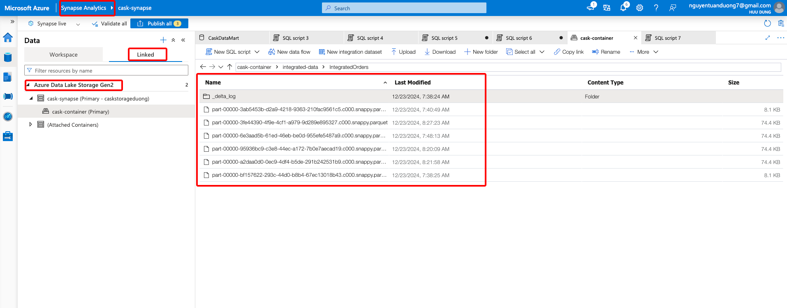

Từ đó ta *IntegratedOrders* có thể được update liên tục khi được dùng tới.

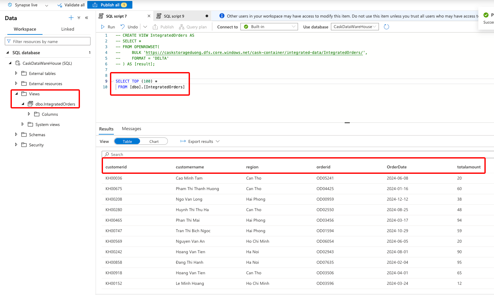

## 📊 **5. Hệ thống kích hoạt tự động**  

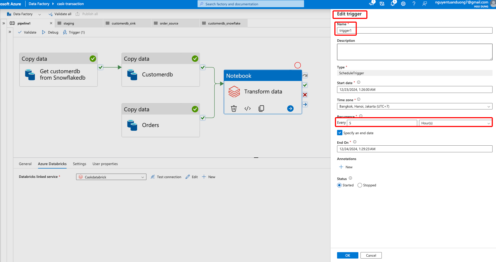

**Mô tả tổng quan:** Hình ảnh mô tả quy trình kích hoạt tự động trong **Azure Data Factory**, cho phép pipeline chạy theo lịch trình định kỳ.

**Loại Trigger:** ScheduleTrigger – Pipeline được kích hoạt theo thời gian cụ thể.

**Tần suất kích hoạt:** Mỗi 5 giờ (Every 5 Hours) – Pipeline tự động chạy mỗi 5 giờ một lần.
